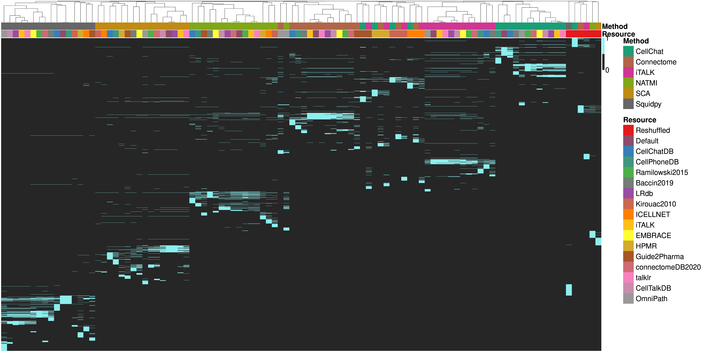

### Background

scRNA-Seq data was aquired via SeuratData for human [pancreatic
cells](https://www.nature.com/articles/nbt.4096)

#### Load Results from different Method-Resource Combinations

##### Note that the objects loaded here were already generated via the pipeline for each method

    # We only define the measures from each method that we wish to have in our analysis
    spec_list <- list("CellChat" =
                          methods::new("MethodSpecifics",
                                       method_name="CellChat",
                                       method_results = readRDS("output/panc8_res/cellchat_results.rds"),
                                       method_scores=list(
                                           "prob"=TRUE
                                           )),
                      "Connectome" =
                          methods::new("MethodSpecifics",
                                       method_name="Connectome",
                                       method_results = readRDS("output/panc8_res/conn_results.rds"),
                                       method_scores=list(
                                           "weight_sc"=TRUE
                                       )),
                      "iTALK" =
                          methods::new("MethodSpecifics",
                                       method_name="iTALK",
                                       method_results = readRDS("output/panc8_res/italk_results.rds"),
                                       method_scores=list(
                                           "weight_comb"=TRUE
                                       )),
                      "NATMI" =
                          methods::new("MethodSpecifics",
                                       method_name="NATMI",
                                       method_results = readRDS("output/panc8_res/natmi_results.rds"),
                                       method_scores=list(
                                          "edge_specificity"=TRUE
                                          )),
                      "SCA" = methods::new("MethodSpecifics",
                                           method_name="SCA",
                                           method_results = readRDS("output/panc8_res/sca_results.rds"),
                                           method_scores=list(
                                              "LRscore"=TRUE
                                              )),
                      "Squidpy" =
                          methods::new("MethodSpecifics",
                                       method_name="Squidpy",
                                       method_results = readRDS("output/panc8_res/squidpy_results.rds"),
                                       method_scores=list(
                                          "pvalue"=FALSE
                                          ))
                      )
    # Define the numbers of highest interactions that we wish to explore
    # and get a list with each threshold as its element
    top_lists <- get_top_hits(spec_list,
                              n_ints=c(100,
                                       250,
                                       500,
                                       1000)
                              )

### Main Text Plots

#### Combine all binary results into heatmap (top500)

Overlap in the 500 highest ranked CCC interactions between different
combinations of methods and resources. Method-resource combinations were
clustered according to binary (Jaccard index) distances. SCA refers to
the SingleCellSignalR method.

    png(filename = figure_path_mr('panc_binheat_top500.png'),
        width = 3000,
        height = 1680)

    p <- get_BinaryHeat(top_lists$top_500)
    grid::grid.draw(p$gtable)

    invisible(dev.off())
    grid::grid.draw(p$gtable)

#### Activity per Cell type

##### Inferred as the proportion of interaction edges that stem from Source Cell clusters or lead to Target Cell clusters in the highest ranked interactions.

    p <- get_activecell(top_lists$top_500)

    png(filename = figure_path_mr('panc_activityheat_top500.png'),
        width = 3000,
        height = 1700)

    grid::grid.draw(p$gtable)
    invisible(dev.off())

    grid::grid.draw(p$gtable)

#### Jaccard index Heatmap

    # Similarity Heatmap (according to Jaccard index)
    p <- get_simdist_heatmap(top_lists$top_500,
                             sim_dist = "simil",
                             method = "Jaccard",
                             diag = TRUE,
                             upper = TRUE)

    png(filename = figure_path_mr('panc_jaccard_top500.png'),
        width = 3200,
        height = 2800)
    grid::grid.draw(p$gtable)
    invisible(dev.off())
    grid::grid.draw(p$gtable)

